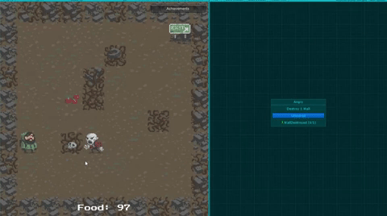
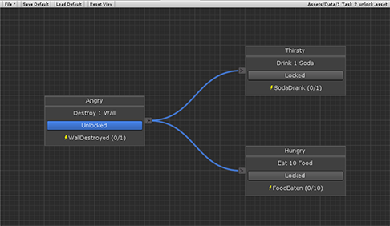
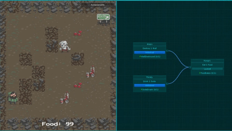

# GateKeeper

A Unity plugin for creating a map of connected tasks.
Triggers are sent to the map during play mode that change the state of tasks.
Connections between tasks can be used to create dependencies. Figure 1 shows a demonstration of this. 

In this guide we will be using the Unity 2D Roguelike tutorial to demonstrate what GateKeeper can do. Download to the Unity tutorial found here https://unity3d.com/learn/tutorials/s/2d-roguelike-tutorial.

Fig 1.

## Installation

Before installing the plugin, make sure that the project is compatible with .NET 4.x scripts. This is done by first going to the File menu and selecting Build Settings (Fig 2.). Next select Player Settings opening up the Inspector window where you will need to click Other Settings (Fig 3.). In Other Settings you will find Scripting Runtime Versions, set this to 4.x if it isn’t already (Fig 4.). Changing this option will require a restart of Unity. 

After changing the Scripting Runtime Version to 4.x or if it was already 4.x,
copy the TaskManager.dll to the Assets folder.
This is usually done in a subfolder called Plugins (Fig 5.).

                                                                                         
 Fig 2.  

                                                                                         
 Fig 3.  

                                                                                         
 Fig 4.  

                                                                                         
 Fig 5. 

## Editor Window

The editor window is used to edit a single task map asset.
It can be opened using the **Window/Tasks** menu item (Fig 6.)
or by double clicking on a task map asset.
At the top of the editor window is a toolbar (Fig 7.).

                                                                                         
 Fig 6.  
 
                                                                                          
 Fig 7.  

The leftmost button on the toolbar is a file menu.
It has three entries:

- New - create a new task map and choose where to save it
- Open - choose an existing task map to open
- Help - Navigate to the online help (this document)

Next to the file menu is a “Save Default” button. This is used to save a default value for the Tasks. They can be reset to this value with the “Load Default” button. Next to these buttons is “Reset View” this will reset the camera to its starting position. Finally, there is a label on the right that displays the path of the currently opened task map. Clicking on this label will highlight the task map asset in the project window.

The rest of the window contains the main panel for editing the task map. Use the left or middle mouse buttons for panning and the scroll wheel for zooming. Right clicking on the background will open up a context menu for adding new tasks (Fig 8.). The **New Task/Generic** item will always be present to add the built-in generic task type. If other task types exist in the project they will also be listed here.

                                                                                          
 Fig 8.  

Tasks can be selected by left clicking.
Holding and dragging will move the task relative to the background.
Holding the control key allows for selecting and dragging of multiple tasks at once (Fig 9.). Use control selecting for copying multiple tasks. After copying, they can be pasted by right clicking on the background.
Tasks should automatically snap to the grid.
Selected tasks can be modified in the Inspector window.
This supports editing multiple tasks at once as long as they are of the same type.

                                                                                          
 Fig 9. 

Drawing connections between tasks is done by left clicking and dragging from an output port
(on the right side of a task).
Release the connection on either an input port or on the task body to connect it (Fig 10.).
Connections can be selected by left clicking.
Again, the control key can be used for multiple selections.

                                                                                          
 Fig 10.

Deleting both tasks and connections can done using either
the delete key or a right click context menu.

## Play Mode

During play mode, the game can interact with the TaskManager MonoBehaviour component.
This component must be attached to a game object.
It contains a list of task maps that can be edited through the Inspector.
It also has a SendTrigger function that can be used to send a trigger to all of the tasks in the maps.
The game object can be persisted between scenes using [DontDestroyOnLoad][DontDestroyOnLoad].

## Customisation

By default, there is only one generic task type.
This has a trigger string with a current trigger count and a trigger target.
When the task is unlocked and the trigger string gets sent to the task,
the trigger count gets incremented by one.
If the trigger count is equal to the trigger target then the task changes to a completed state.
If a task is locked it will unlock once all the input tasks are completed.

Other task types can be created by deriving from the abstract Task class.
The following members need to be overridden:

## DrawBodyContent

This is called to draw the body of the task in the editor window.
It is best to use [GUI][GUI] functions
instead of [GUILayout][GUILayout] functions
as they work better with the panel zooming.
It gets passed a Rect that defines the position and size of the task body.
If a larger size is required then the Size property can be altered.
This defines the size of the whole task (head + body).

## OnInputStatusChanged

This is an action that is called when the state of an input task changes.
In the generic task type this is the function that
checks to see if all of the input tasks are now in a completed state.
Access to the input tasks themselves is given through an Inputs property.

## OnTrigger

 

An action that is called when a trigger is sent to the task.
It takes the trigger string as an argument.
For the generic task type, this function simply increments a trigger count
if the task is unlocked and trigger is equal to the task's trigger.
If desired this function could be much more complex
by accepting many different triggers with different effects.

## States

This is a dictionary of the possible states the task can take. The ones in use for the example scenes are Locked, Unlocked, Completed and Failed.
The dictionary keys are names of the states, as they are keys they must be unique.

The dictionary values are the colours associated with the states.
These do not have to be unique they are simply to distinguish between different states in the editor.

[DontDestroyOnLoad]: https://docs.unity3d.com/ScriptReference/Object.DontDestroyOnLoad.html
[GUI]: https://docs.unity3d.com/ScriptReference/GUI.html
[GUILayout]: https://docs.unity3d.com/ScriptReference/GUILayout.html

## Example Scenes

 - Simple Test
 - One to Two
 - Two to One
 - One to Other

## Simple Test

This scene is a simple test, where once an objective is met the task is complete. This scene shows how destroying a wall completes the task.

## One to Two

This scene allows one task to unlock two other tasks.  There is no limit to the number of tasks that can be unlocked by one task. This scene shows how destroying a wall opens up the next two tasks to become unlocked, allowing them to be completed once the requirements are met. 

## Two to One

This scene shows how two tasks need to be completed before a third task can be unlocked.  More than two tasks can be set before another is unlocked. In this scene the character must destroy a wall and eat some food before unlocking the drink soda task. If the player was to drink soda before completing the previous two tasks it wouldn't be tracked. 

## One or Other

This scene shows how a single task can be unlocked in multiple ways. This scene shows how the character unlocks the eat food task by completing the destroy wall task. Then after those two tasks are complete he in essence can go backwards and complete the drink soda task. 

