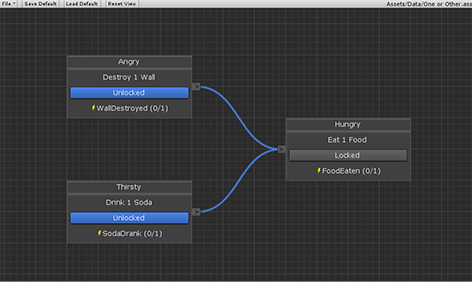

# Example Scenes

 - Simple Test
 - One to Two
 - Two to One
 - One to Other

## Simple Test

This scene is a simple test, where once one item is collected the task is complete.

## One to Two

This scene allows one task to unlock two other tasks.  There is no limit to the number of tasks that can be unlocked by one task.

## Two to One

This scene shows how two tasks need to be completed before a third task can be unlocked.  More than two tasks can be set before another is unlocked.

## One or Other

This scene shows how a single task can be unlocked in multiple ways.

